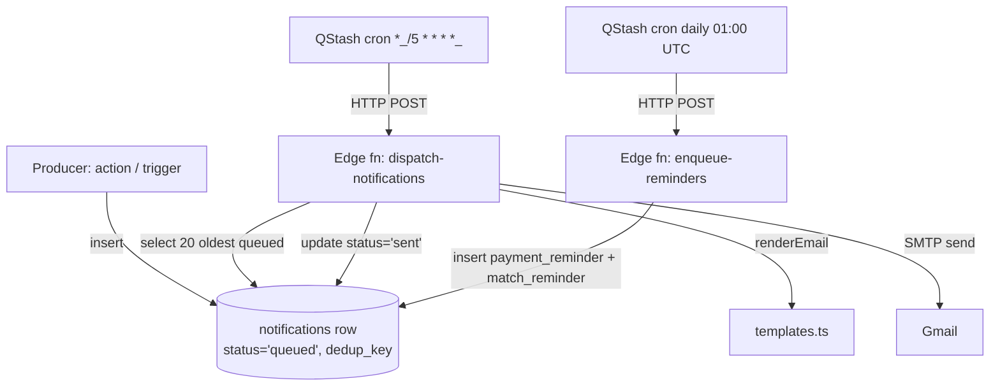

# System Architecture

## Stack

```
┌──────────────┐    HTTPS    ┌──────────────────────┐
│   Browser    │◄───────────►│  Vercel (Next.js 16) │
└──────────────┘             │   App Router + RSC   │
                             └─────────┬────────────┘
                                       │ supabase-js (anon + service)
                                       ▼
                             ┌──────────────────────┐
                             │       Supabase       │
                             │  Postgres / Auth /   │
                             │  Storage / Edge Fns  │
                             └─────────┬────────────┘
                                       ▲
                  HTTP (cron) ┌────────┴────────┐
                              │     Upstash     │
                              │ QStash / Redis  │
                              └─────────────────┘
```

## Data flow — read

1. Browser hits a public route (RSC).
2. Server component creates an SSR Supabase client (cookie-bound, anon JWT).
3. Client selects from a `v_*_public` view — `security_invoker = true`, so RLS still applies.
4. View strips PII (`dob`, `phone`, `email` etc.).
5. Page renders, `revalidate` controls cache (5min on home, 1min on detail).

## Data flow — write (server action)

1. Client form submit → server action in `src/server/admin/*` or `src/app/.../actions.ts`.
2. Action runs in Node runtime, creates SSR Supabase client (user JWT).
3. Action checks role gate (`isAdmin()` etc.) when admin-scoped.
4. Action issues mutation or RPC; RLS enforces row-level rules.
5. `revalidatePath()` invalidates relevant routes.

## Data flow — notifications



## RLS pattern

- Every base table has RLS enabled with deny-by-default.
- Policies live in `000003_shared_rls.sql` and `000008_thethaomammo_rls.sql`.
- Reusable predicates: `shared.has_role(app text, role text)` and `shared.has_grant_scope(app, role, scope_id)`.
- Public reads bypass RLS via `v_*_public` views (security_invoker=true; views still enforce policies on underlying tables but expose only safe columns).
- Service-role bypass is only used inside edge functions and explicitly within `bulk_create_athletes` RPC under an in-function role check.

## Schemas

- `auth.*` — Supabase-managed (do not modify)
- `shared.*` — cross-app: app registry, role grants, helpers
- `thethaomammo.*` — this app's tables, views, RPCs

## Realtime

- Channel: `tournament:<id>`
- Postgres changes filter: `event_id=in.(...)` on `matches` and `match_scores`
- Client: `src/components/live/live-matches.tsx`

## Edge functions

| Function | Trigger | Purpose |
|---|---|---|
| `dispatch-notifications` | QStash every 5min | Dequeue 20 queued, SMTP send, mark sent/failed |
| `enqueue-reminders` | QStash daily 01:00 UTC | Insert payment + match reminders within 24h |

Both verify Upstash signature when `QSTASH_CURRENT_SIGNING_KEY` is set.

## Storage buckets

| Bucket | Public | Purpose |
|---|---|---|
| `payment-proofs` | private (signed URLs, 10-min TTL) | Per-registration payment proof |
| `tournament-assets` | public | Sponsor logos, payment QR |
| `gallery` | public | Tournament gallery photos |

## Trust boundaries

- Public site ← `v_*_public` views only. Never reads base tables directly.
- Admin actions ← user-scoped Supabase client; never service role.
- Edge fns ← service role; HMAC-verify caller.
- Tiptap rules HTML ← sanitized via DOMPurify on save AND on render.
